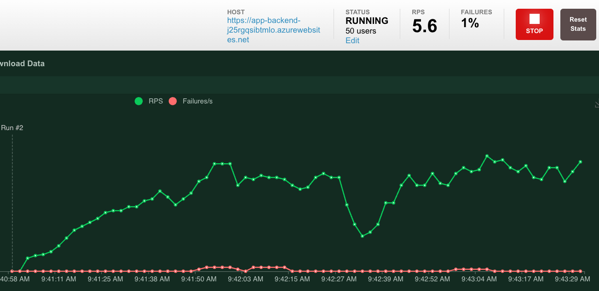

# Productionizing the Chat App

This sample is designed to be a starting point for your own production application,
but you should do a thorough review of the security and performance before deploying
to production. Here are some things to consider:

* [Azure resource configuration](#azure-resource-configuration)
* [Additional security measures](#additional-security-measures)
* [Load testing](#load-testing)
* [Evaluation](#evaluation)

## Azure resource configuration

### OpenAI Capacity

The default TPM (tokens per minute) is set to 30K. That is equivalent
to approximately 30 conversations per minute (assuming 1K per user message/response).
You can increase the capacity by changing the `chatGptDeploymentCapacity` and `embeddingDeploymentCapacity`
parameters in `infra/main.bicep` to your account's maximum capacity.
You can also view the Quotas tab in [Azure OpenAI studio](https://oai.azure.com/)
to understand how much capacity you have.

If the maximum TPM isn't enough for your expected load, you have a few options:

* Use a backoff mechanism to retry the request. This is helpful if you're running into a short-term quota due to bursts of activity but aren't over long-term quota. The [tenacity](https://tenacity.readthedocs.io/en/latest/) library is a good option for this, and this [pull request](https://github.com/Azure-Samples/azure-search-openai-demo/pull/500) shows how to apply it to this app.

* If you are consistently going over the TPM, then consider implementing a load balancer between OpenAI instances. Most developers implement that using Azure API Management using [the openai-apim-lb repo](https://github.com/Azure-Samples/openai-apim-lb) or with Azure Container Apps using [the openai-aca-lb repo](https://github.com/Azure-Samples/openai-aca-lb). Another approach is to use [LiteLLM's load balancer](https://docs.litellm.ai/docs/providers/azure#azure-api-load-balancing) with Azure Cache for Redis.

### Azure Storage

The default storage account uses the `Standard_LRS` SKU.
To improve your resiliency, we recommend using `Standard_ZRS` for production deployments,
which you can specify using the `sku` property under the `storage` module in `infra/main.bicep`.

### Azure AI Search

The default search service uses the `Standard` SKU
with the free semantic search option, which gives you 1000 free queries a month.
Assuming your app will experience more than 1000 questions, you should either change `semanticSearch`
to "standard" or disable semantic search entirely in the `/app/backend/approaches` files.
If you see errors about search service capacity being exceeded, you may find it helpful to increase
the number of replicas by changing `replicaCount` in `infra/core/search/search-services.bicep`
or manually scaling it from the Azure Portal.

The search service can handle fairly large indexes, but it does have per-SKU limits on storage sizes, maximum vector dimensions, etc.
See the [service limits document](https://learn.microsoft.com/azure/search/search-limits-quotas-capacity) for more details.

### Azure App Service

The default app service plan uses the `Basic` SKU with 1 CPU core and 1.75 GB RAM.
We recommend using a Premium level SKU, starting with 1 CPU core.
You can use auto-scaling rules or scheduled scaling rules,
and scale up the maximum/minimum based on load.

## Additional security measures

* **Authentication**: By default, the deployed app is publicly accessible.
  We recommend restricting access to authenticated users.
  See [Enabling authentication](./deploy_features.md#enabling-authentication) to learn how to enable authentication.
* **Networking**: We recommend deploying inside a Virtual Network. If the app is only for
  internal enterprise use, use a private DNS zone. Also consider using Azure API Management (APIM)
  for firewalls and other forms of protection.
  For more details, read [Azure OpenAI Landing Zone reference architecture](https://techcommunity.microsoft.com/t5/azure-architecture-blog/azure-openai-landing-zone-reference-architecture/ba-p/3882102).

## Load testing

We recommend running a loadtest for your expected number of users.
You can use the [locust tool](https://docs.locust.io/) with the `locustfile.py` in this sample
or set up a loadtest with Azure Load Testing.

To use locust, first install the dev requirements that includes locust:

```shell
python3 -m pip install -r requirements-dev.txt
```

Or manually install locust:

```shell
python3 -m pip install locust
```

Then run the locust command:

```shell
locust
```

Open the locust UI at http://localhost:8089/, the URI displayed in the terminal.

Start a new test with the URI of your website, e.g. `https://my-chat-app.azurewebsites.net`.
Do *not* end the URI with a slash. You can start by pointing at your localhost if you're concerned
more about load on OpenAI/AI Search than the host platform.

For the number of users and spawn rate, we recommend starting with 20 users and 1 users/second.
From there, you can keep increasing the number of users to simulate your expected load.

Here's an example loadtest for 50 users and a spawn rate of 1 per second:



After each test, check the local or App Service logs to see if there are any errors.

## Evaluation

Before you make your chat app available to users, you'll want to rigorously evaluate the answer quality. You can use tools in [the AI RAG Chat evaluator](https://github.com/Azure-Samples/ai-rag-chat-evaluator) repository to run evaluations, review results, and compare answers across runs.
